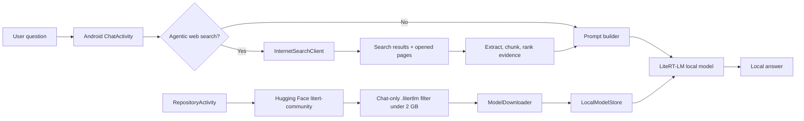

# LiteRT Local RAG Chatbot for Android

<p align="center">
  <b>Run small chat LLMs directly on Android, download LiteRT-LM models from Hugging Face, and answer questions with optional web RAG.</b>
</p>

<p align="center">
  
  
  
  
  
</p>

---

## Overview

**LiteRT Local RAG Chatbot** is a native Android application for experimenting with small on-device language models. The app can download compatible `.litertlm` chat models from the `litert-community` Hugging Face repositories, store them locally on the phone, load them with Google AI Edge LiteRT-LM, and answer user questions without sending the conversation to a cloud LLM.

For current or knowledge-based questions, the app can optionally perform an **agentic web search** first, extract useful page evidence, and pass the compressed context to the local model as RAG input.

---

## Key Features

- **On-device LLM chat** using `.litertlm` model bundles.
- **Chat-only model repository browser** for LiteRT-LM compatible models below 2 GB.
- **Hugging Face model download** directly inside the Android app.
- **Local model storage** and automatic local model discovery.
- **CPU and optional GPU backend** support through LiteRT-LM.
- **Agentic web RAG**: search the web, open sources, extract evidence, rank context, and answer locally.
- **Structured live-data handling** for cases where a deterministic answer is better than model guessing.
- **Formatted code and thinking display options** for demos and teaching.
- **Privacy-friendly design**: the selected model runs locally; only optional web search requests leave the device.

---

## Why This Project?

Most mobile chatbot demos depend on a cloud API. This project focuses on a lightweight local-first architecture:

1. Download a small LiteRT-LM chat model.
2. Load it directly on Android.
3. Search the web only when needed.
4. Send compact evidence to the local model.
5. Generate the answer on the phone.

This makes the app useful for teaching, prototyping, mobile AI experiments, and privacy-aware local assistant demos.

---

## App Screens

The app has three main screens:

| Screen | Purpose |
|---|---|
| **Main screen** | Shows local model status and opens the repository or chat view. |
| **Model Repository** | Lists downloadable chat-compatible `.litertlm` models and stores them locally. |
| **Local Model Chat** | Loads a local model and answers questions with optional web RAG. |

---

## Architecture



---

## Recommended Chat Models

The app should show only **main chat/answer models**, not embedding models, ASR models, image classifiers, VLMs, or mobile-action/function models.

Recommended LiteRT-LM chat models for phones:

| Model | Suggested use |
|---|---|
| `litert-community/Qwen3-0.6B` | Best default small model for web-RAG chat. |
| `litert-community/Gemma3-1B-IT` | Stronger answer quality if the phone can handle it. |
| `litert-community/Qwen2.5-1.5B-Instruct` | Better reasoning under the 2 GB target when quantized. |
| `litert-community/DeepSeek-R1-Distill-Qwen-1.5B` | Reasoning-style answers, heavier than Qwen3-0.6B. |
| `litert-community/Qwen2.5-0.5B-Instruct` | Small fallback model. |
| `litert-community/SmolLM2-360M-Instruct` | Fast, very small chat model. |
| `litert-community/gemma-3-270m-it` | Tiny Gemma model for lightweight demos. |
| `litert-community/TinyLlama-1.1B-Chat-v1.0` | Classic small chat model. |

> Gemma repositories may require accepting the model license on Hugging Face before download.

---

## What Is Intentionally Not Listed?

The app is designed to load **chat `.litertlm` bundles** as the main local model. Therefore, the repository browser should not show:

- embedding models such as `embeddinggemma-300m`,
- ASR models such as Whisper, Parakeet, Moonshine, or Qwen ASR,
- image classification models such as MobileNet, ResNet, EfficientNet, or VGG,
- VLM/image models such as FastVLM or SmolVLM,
- mobile-action/function-only models,
- translation-only or medical-specialized models.

These models can be useful in other apps, but they are not suitable as the main chat model for this project.

---

## Tech Stack

- **Language:** Java
- **Platform:** Android
- **Minimum SDK:** 27
- **Target SDK:** 36
- **Build system:** Gradle Kotlin DSL
- **Local inference:** Google AI Edge LiteRT-LM
- **Model source:** Hugging Face `litert-community`
- **UI:** AndroidX, AppCompat, Material Components, ConstraintLayout

---

## Project Structure

```text
ChatBot-main/
├── app/
│   ├── src/main/java/com/example/chatbot/
│   │   ├── MainActivity.java
│   │   ├── RepositoryActivity.java
│   │   ├── ChatActivity.java
│   │   ├── LiteRtGemmaClient.java
│   │   ├── HuggingFaceModelRepositoryClient.java
│   │   ├── InternetSearchClient.java
│   │   ├── ModelDownloader.java
│   │   ├── ModelInfo.java
│   │   └── LocalModelStore.java
│   └── src/main/res/
├── gradle/
├── build.gradle.kts
├── settings.gradle.kts
└── README.md
```

---

## Getting Started

### 1. Clone the repository

```bash
git clone https://github.com/YOUR_USERNAME/YOUR_REPOSITORY.git
cd YOUR_REPOSITORY
```

### 2. Open in Android Studio

Open the project folder in Android Studio and let Gradle sync the dependencies.

### 3. Build and install

Use Android Studio or run:

```bash
./gradlew assembleDebug
```

### 4. Download a model

Inside the app:

1. Open **Model Repository**.
2. Select a chat-compatible `.litertlm` model.
3. Tap **Download model**.
4. Return to **Local Model Chat**.
5. Select the downloaded model and tap **Load selected**.

### 5. Ask a question

Enable **Agentic internet search** when the question needs current web information. Disable it for normal offline/local chat.

---

## Android Permission

The app needs internet access for model downloads and optional web RAG:

```xml
<uses-permission android:name="android.permission.INTERNET" />
```

Local model inference itself does not require internet access after the model is downloaded.

---

## Notes About Web RAG

The web RAG pipeline is designed for small local models. It should keep the prompt compact and evidence-based:

1. Search the web.
2. Open selected pages.
3. Extract readable text and source snippets.
4. Rank the most relevant evidence.
5. Build a small context prompt.
6. Ask the local model to answer with source references.

For live numeric facts such as prices, exchange rates, weather, or stock values, deterministic API/parsing results should be preferred over asking a tiny model to infer the value from news snippets.

---

## Limitations

- Tiny models can still hallucinate if the retrieved context is weak.
- Web pages can block automated extraction or return incomplete text.
- Image RAG requires a real vision-language model; a text-only `.litertlm` model can only use image metadata such as alt text, captions, and nearby text.
- Large models may not fit on older phones even if the file is below 2 GB.
- GPU support depends on the Android device and available native libraries.

---

## Roadmap

- [ ] Better streaming token output.
- [ ] Source cards with clickable URLs.
- [ ] Better deterministic tools for live prices, weather, and exchange rates.
- [ ] Optional multilingual prompts.
- [ ] Local conversation history.
- [ ] Safer prompt templates for small models.
- [ ] Model benchmark screen for speed and memory usage.

---

## Repository Description

> Android local LLM chatbot using Google AI Edge LiteRT-LM. Download chat-compatible `.litertlm` models from Hugging Face, run them on-device, and optionally answer with agentic web RAG.

---

## Suggested GitHub Topics

```text
android
java
litert
litert-lm
google-ai-edge
on-device-ai
local-llm
mobile-ai
chatbot
rag
web-rag
agentic-search
huggingface
qwen
gemma
privacy
offline-ai
android-ai
llm
edge-ai
```

---

## License

Add a license before publishing. For an open-source demo, **MIT License** is a simple and common choice.

---

## Acknowledgements

- Google AI Edge LiteRT-LM for on-device language model execution.
- Hugging Face and the `litert-community` model repositories.
- Open-source Android and Java ecosystem.
